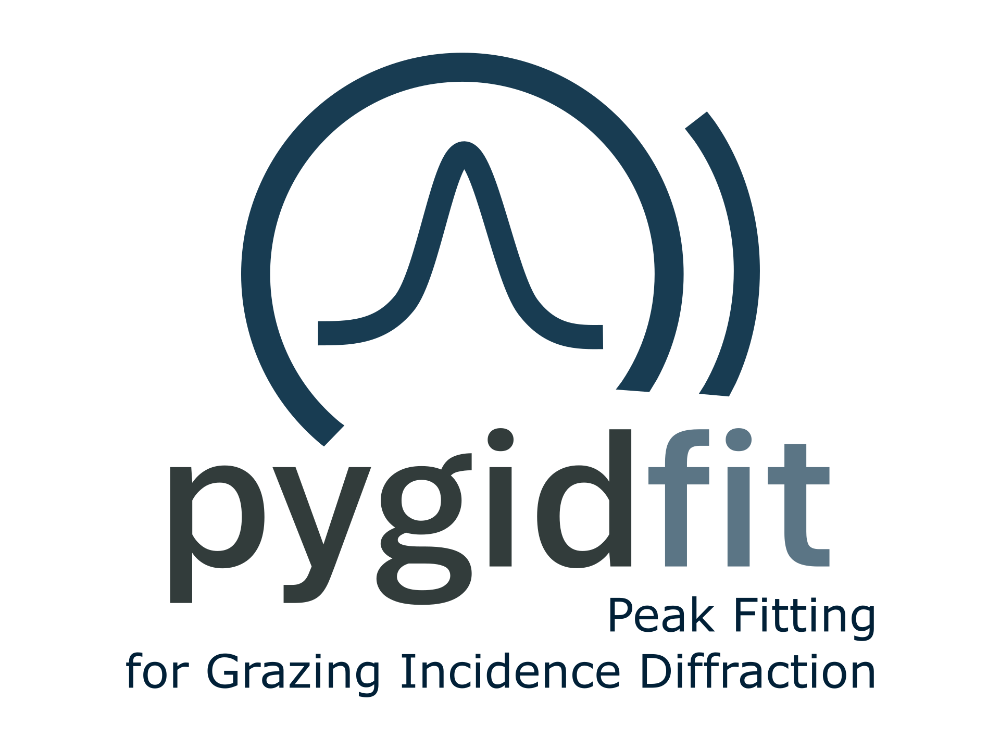

# pygidFIT: Gaussian fitting for grazing incidence diffraction (GID) data

A Python package for fitting Gaussian functions to GID (Grazing-Incidence Wide-Angle X-ray and Neutron Scattering) data. 
pygidFIT is part of the comprehensive machine learning pipeline for automated analysis of GID data. The focus is on multiparallel execution for real-time sequential processing at the synchrotron and neutron facilities.

<p align="center">
  
</p>

## Installation

So far, only source installation is supported:

```bash
git clone git@github.com:mlgid-project/pygidFIT.git
cd pygidFIT
pip install -e .
```

## Usage

### Images from *pygid* NeXus file
```python
from pygidfit import ProcessDataFromFile

filename = './notebooks/result.h5'
analysis = ProcessDataFromFile(
    filename,                           # NeXus file with converted images and detected boxes (after pygid and mlgidDETECT)
    entry='entry_0000',                 # Entry to process (if None, processes all entries)
    frame_num=0,                        # Image frame to process (if None, processes all frames)
    crit_angle = 2,                     # Critical angle to shift the sample horizon (in degrees)
    clustering_distance_rings = 10,     # Distance for ring clustering (in pixels)
    clustering_distance_peaks = 10,     # Distance for segments clustering (in pixels)
    clustering_extend=2,                # Number of pixels to extend the cluster size
    use_pool = False,                   # Whether to use peak pool from the previous image 
    debug = False)                      # Whether to plot fitting result and parameters)
```

### Fit single image

```python
from pygidfit import fit_data

img_container_fit = fit_data(
    polar_img = polar_img,              # 2D polar-transformed scattering image. Axis 0: polar angle (0–90°). Axis 1: radial coordinate |q| (Å⁻¹)
    radius = radius,                    # 1D array of radial centers of peak boxes (Å⁻¹)
    radius_width = radius_width,        # 1D array of radial widths of peak boxes (Å⁻¹)
    angle = angle,                      # 1D array of angular centers of peak boxes (degrees)
    angle_width = angle_width,          # 1D array of angular widths of peak boxes (degrees)
    wavelength = 1e-10,                 # X-ray wavelength in meters. Used for missing-wedge calculation
    q_xy_max = 3.5,                     # Upper cutoff for q_xy (Å⁻¹) used in peak classification
    q_z_max = 3.5,                      # Upper cutoff for q_z (Å⁻¹) used in peak classification
    clustering_distance_peaks = 10,     # Distance for ring clustering (in pixels)
    clustering_distance_rings = 10,     # Distance for segments clustering (in pixels)
    clustering_extend = 2,              # Number of pixels to extend the cluster size
    debug = False,                      # Whether to plot fitting result and parameters)
    peaks_pool = None)                  # List of pygidfit.Boxes or None (if don't use pool) 
```

polar_img, radius, radius_width, angle, angle_width, polar_shape, wavelength, q_xy_max, q_z_max, ang_deg_max = 90,
             ratio_threshold = 50, clustering_distance_peaks = 10,
             clustering_distance_rings = 10, clustering_extend = 2, debug = False, multiprocessing = False, peaks_pool = None

fit_data(polar_img, radius, radius_width, angle, angle_width, polar_shape, wavelength, q_xy_max, q_z_max, ang_deg_max,
             ratio_threshold, clustering_distance_peaks,
             clustering_distance_rings, clustering_extend, debug, multiprocessing, peaks_pool)

## Overview

pygidFIT is part of the machine learning pipeline for automated analysis of GID data. It is designed to analyze scattering data by fitting Gaussian profiles to peaks in both 1D and 2D data. It refines the peak positions revealed by the deep learning-based peak detection by automated conventional fitting during the postprocessing stage. 

## Key Features

- **Peak clustering**: Groups spatially close peaks to improve fitting stability

- **Parameter reuse**: Caches fit parameters from previous frames to accelerate time-series analysis

- **Parallel execution**: Supports multiprocessing for efficient processing of large datasets

- **HDF5 compatibility**: Operates directly on HDF5 files generated by pygid.DataSaver

## Authors 

The package is developed by Ekaterina Kneschaurek @ [the Schreiber Lab](https://github.com/schreiber-lab) with the help of [Vladimir Starostin](https://github.com/StarostinV) ([mlcolab](https://github.com/mlcolab)), [Constantin Völter](https://github.com/cvoelt).

Current maintenance and development are led by [Ainur Abukaev](https://github.com/ainurabukaev99).
## License

MIT 