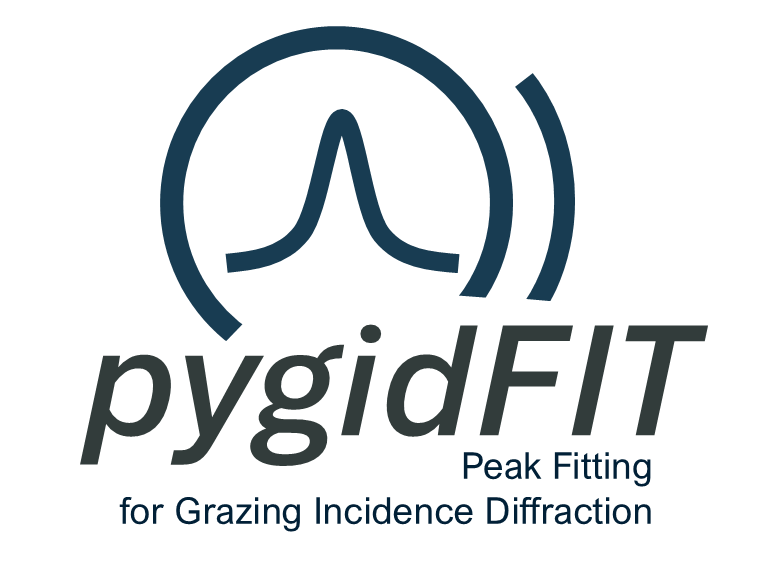

# pygidFIT: gaussian fitting for grazing incidence diffraction (GID) data

A Python package for fitting Gaussian functions to GID (Grazing-Incidence Wide-Angle X-ray and Neutron Scattering) data. 
pygidFIT is part of the comprehensive machine learning pipeline for automated analysis of GID data. The focus is on multiparallel execution for real-time sequential processing at the synchrotron and neutron facilities.

<p align="center">
  
</p>


## Installation

So far, only source installation is supported:

```bash
git clone git@github.com:mlgid-project/pygidFIT.git
cd pygidFIT
pip install -e .
```

## Usage

```python
import pygidfit
filename = r'..\tests\example.h5'
# Run scans on the given file
# crit_angle: critical angle for the material
# multiprocessing: whether to use multiprocessing
# use_pool: whether use pool of peaks
pygidfit.run_scans(
    filename,
    crit_angle=0.1,
    multiprocessing=False,
    use_pool = False,
)
```

## Overview

pygidFIT is part of the machine learning pipeline for automated analysis of GID data. It is designed to analyze scattering data by fitting Gaussian profiles to peaks in both 1D and 2D data. It refines the peak positions revealed by the deep learning-based peak detection by automated conventional fitting during the postprocessing stage. 

## Key Features

- **Efficient Clustering:** Groups nearby peaks for better fitting
- **Parameter Reuse:** Maintains a cache of previous fit parameters to speed up processing of time series
- **Parallel Processing:** Uses multiprocessing for faster fitting of large datasets
- **HDF5 Integration:** Works with HDF5 file format common in synchrotron data

## Authors 

The package is developed by Ekaterina Kneschaurek @ [the Schreiber Lab](https://github.com/schreiber-lab) with the help of [Vladimir Starostin](https://github.com/StarostinV) ([mlcolab](https://github.com/mlcolab)), [Constantin Völter](https://github.com/cvoelt) and [Ainur Abukaev](https://github.com/ainurabukaev99).


## License

MIT 